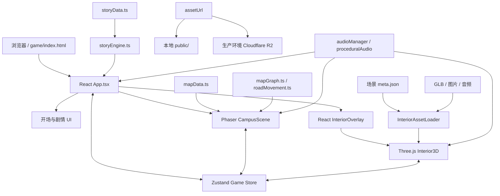

# 浙大夜惊魂 · ZJU Night Scare

一款以浙江大学紫金港校区为舞台的网页恐怖探索游戏。玩家扮演生命科学系学生张超，在停滞于 **23:47** 的深夜里，沿着室友林伟留下的线索穿过农医馆、白沙宿舍、医学院、启真湖与小剧场，调查坠楼事件背后的旧案。

游戏将两种游玩空间串成一条完整流程：

- **校园外景**：Phaser 3 驱动的 2.5D 等距地图，包含道路移动、任务导航、建筑热点、环境异象与红鬼追逐。
- **建筑内景**：Three.js 驱动的第一人称 3D 探索，包含碰撞、手电筒、道具拾取、实体交互、规则怪谈、追逐、跳脸与场景状态变化。
- **叙事与 UI**：React 负责开场、HUD、剧情弹层、选择反馈、背包、剧情链、小地图、死亡/复活与结局展示。
- **共享状态**：Zustand 在 React、Phaser 与 Three.js 之间同步玩家属性、剧情进度、背包、世界状态和鬼魂信息。

> 内容提示：本作包含突然出现的惊吓画面、追逐、闪烁、屏幕震动、低频音效，以及虚构的死亡和超自然情节。建议佩戴耳机游玩；对闪光敏感的玩家请谨慎体验。

[项目主页](https://sjyinzju.github.io/ZJU-night-scare/) · [直接开始游戏](https://sjyinzju.github.io/ZJU-night-scare/game/) · [提交问题](https://github.com/sjyinzju/ZJU-night-scare/issues)

## 当前版本内容

当前版本已经实现从农医馆开场到小剧场终章的连续可玩流程：

1. **农医馆 / 医学院图书馆**：寻找手电筒，调查笔记本与异常借阅小票，在随机书架和室外灯下完成第一轮揭示。
2. **白沙宿舍**：经历合照异变、阳台人影、校园论坛旧帖和走廊逃生，并与白秋建立不同程度的信任与关系。
3. **校园调查**：在临湖餐厅、杜学民办公室、东教学区和启真湖串联人物证词、旧档案与门禁时间线。
4. **医学院**：依次探索六层教学区、地下一层车库与地下仓库；阅读巡查守则，核对 601/603/605 房间异常，借雷光完成封印路线，并在地下整理关键证据。
5. **小剧场终章**：调查最后一盒胶片、后台镜面和被剪过的唱段，穿过追逐与放映事件，依据证据、关系、属性和最终行动进入不同结局。

游戏数据目前包含：

- 8 个主线调查地点与 34 个剧情状态节点；
- 5 项可变化属性与 10 类剧情道具；
- 4 组重点 3D 场景：农医馆、白沙宿舍、医学院多段空间、小剧场；
- 7 种终章结果方向，包括真相公开、共同脱离、逃离、牺牲与噩梦等；
- 桌面端和移动端两套输入方式。

## 操作方式

### 桌面端

| 操作 | 按键 |
| --- | --- |
| 移动 | `W A S D` 或方向键 |
| 奔跑 | `Shift` |
| 跳跃 | `Space` |
| 蹲下 | `Ctrl` 或 `C` |
| 互动 / 开门 / 拾取 | `E` |
| 第一人称视角 | 点击 3D 画面锁定鼠标，移动鼠标观察 |
| 释放鼠标 | `Esc` |
| 碰撞调试 | `F3`，仅用于开发与 QA |

校园外景会将输入投影到道路方向，并在路口提前识别转向。红色虚线指向当前目标；靠近热点会自动触发，处在较宽的交互范围内时也可按 `E` 确认。

### 移动端

- 左侧虚拟摇杆控制移动；
- 右侧区域拖动视角；
- 点击屏幕上的互动按钮完成拾取、开门和剧情操作；
- 外景与内景共用触控 HUD，并针对窄屏调整任务链、背包与小地图布局。

## 游戏系统

### 双空间探索

外景与内景不是彼此独立的关卡。玩家从校园道路进入剧情建筑后，Phaser 场景暂停，Three.js 内景接管输入；离开建筑时，玩家会回到对应道路出口，剧情引擎再决定下一个地点。`world` 与 `transition` 状态保证重复靠近或连续按键不会重复挂载场景。

### 校园地图与寻路

紫金港外景由声明式地图数据生成，当前包括 26 栋建筑、8 个广场、15 条道路和 3 片水域。建筑使用多体块组合呈现不同轮廓，道路节点则由统一坐标约束，避免视觉道路与实际移动路径错位。

- 玩家沿路网移动，广场区域允许更自由的走位；
- `MapGraph` 使用 Dijkstra 算法生成任务引导与鬼魂追击路线；
- 路口选择会结合屏幕方向、当前行进方向和红色引导，减少等距投影下的方向歧义；
- 小地图同步玩家、目标与可见威胁的位置。

### 外景追逐与复活

玩家获得控制权后有短暂安全时间，随后红鬼会从远处生成并沿道路最短路径持续追击。近距离接触会反复损失理智，贴身则直接触发死亡。

- 默认拥有 2 次复活机会，即一局共 3 条命；
- 复活后回到最近的安全剧情状态，并恢复部分理智；
- 白沙宿舍追逐拥有独立检查点；护身符可在对应死亡路径中优先消耗；
- 剧情弹层、内景加载和场景切换期间，外景追击会被冻结，避免玩家尚未取得控制权就受伤。

### 第一人称内景

`Interior3D` 管理相机、移动状态机、碰撞、交互射线、灯光、手电筒、场景锚点和小地图快照。运行时优先加载 Blender 导出的 GLB 与配套元数据；加载失败时保留程序化房间作为防崩溃回退，但回退场景不等于正式场景验收通过。

重点内景各有独立玩法运行时：

| 场景 | 主要机制 |
| --- | --- |
| 农医馆 | 随机化拾取点、书架事件、借阅小票、符咒、坠楼人物与路灯揭示 |
| 白沙宿舍 | 相框与阳台叙事、论坛界面、动态走廊、分支追逐、能量增益与出口检查点 |
| 医学院六层 | 27 条巡查守则、病床让行、601 记录、603 标本、605 监控与随机异常路线 |
| 医学院车库 | 雷光可见性、路线节点、蜡烛、文件与封印交互 |
| 医学院地下仓库 | 羽毛、证据收集、笔记擦拭/翻页、结论选择与锁门惊吓 |
| 小剧场 | 胶片、后台镜面、唱段证据、阶梯地形、追逐、观众席放映与终局选择 |

### 剧情、选择与结局

`storyData.ts` 声明剧情节点、地点、文本、选择、属性变化、道具与标记位；`storyEngine.ts` 负责选择结算、条件检查、地点切换和出口命令。实体交互与剧情弹层最终写回同一份故事状态，不另建旁路进度。

最终结果不由单个按钮决定，而会综合：

- 已收集的证据组与现实锚点；
- 理智、体力、线索、信任和好感；
- 是否保留、切断或隔离关键唱轨；
- 白秋是否清醒、是否尊重她的自主选择；
- 张一诚与场外支援是否准备就绪；
- 玩家在终局采取的行动。

### 属性与道具

| 属性 | 作用 |
| --- | --- |
| 理智 `sanity` | 过低会强化画面与音频异常；归零进入死亡流程，并影响噩梦结局判定 |
| 体力 `stamina` | 支撑奔跑和部分逃生路线，可通过能量饮料恢复 |
| 线索 `clues` | 衡量时间线与证据完整度，影响公开真相等高要求结局 |
| 信任 `trust` | 影响同伴协作、支援时机和终章结果 |
| 好感 `affection` | 记录与白秋的关系和照护选择，参与人物结局判定 |

当前道具包括护身符、手电筒、借阅小票、门禁卡、镇定药、日记残页、老照片、猫头鹰羽毛、能量饮料和苏婉旧胶片。道具既可解锁选择，也可改变内景机关、复活和结局条件。

### 恐怖表现与音频

- 统一的 `JumpscarePipeline` 编排画面、文字、图片、震动与音效时序；
- 跳脸图片会预加载并等待解码，失败时回退到程序化视觉，避免显示破图；
- 外景包含雾、暗角、扫描线、色差、镜头脏痕、建筑标签故障和阶段性环境事件；
- Howler.js 播放 BGM、环境音和文件型 SFX；
- Web Audio API 合成心跳、脚步、文字轻响、鬼呼吸与部分惊吓声；
- 音乐会根据剧情弹层、低理智、死亡和终章放映自动淡入、压低或重启。

## 项目架构



核心边界如下：

- **React** 负责编排和可见 UI，不直接承担外景或 3D 帧循环；
- **Phaser** 负责校园地图、道路移动、热点、外景碰撞、环境特效和追击；
- **Three.js** 负责内景模型、相机、灯光、碰撞、交互与各场景专属玩法；
- **Zustand** 是三者共享的单一运行时状态源；
- **剧情数据与引擎** 决定故事合法状态和下一步路由；
- **元数据** 决定 3D 出生点、道具点、剧情点、出口、清障区域及其他玩法锚点；
- **`assetUrl()`** 是所有运行时资源的统一入口，负责本地与 CDN 地址切换。

## 技术栈

| 层 | 技术 | 用途 |
| --- | --- | --- |
| UI 与编排 | React 19、React DOM | 游戏壳层、HUD、剧情、背包、小地图、结局 |
| 语言 | TypeScript 5.7 | 类型化剧情、地图、运行时与组件接口 |
| 校园外景 | Phaser 3.87 | 2.5D 等距渲染、输入、道路移动、特效与追击 |
| 建筑内景 | Three.js 0.185 | 第一人称 3D、GLB、灯光、材质、碰撞和交互 |
| 状态管理 | Zustand 5 | React、Phaser、Three.js 共享状态 |
| 音频 | Howler.js、Web Audio API | 文件音频、混音、程序化恐怖音效 |
| 图标 | Lucide React | HUD 和界面图标 |
| 构建 | Vite 6 | 开发服务器、TypeScript 构建与生产打包 |
| 资产制作 | Blender、Python 工具 | 校园建筑、内景 GLB、锚点和检查图生成 |
| 部署 | GitHub Pages、Cloudflare R2 | 网页代码与大型运行时资源分离发布 |

## 目录结构

```text
.
├─ game/
│  └─ index.html                     # Vite 游戏入口
├─ src/
│  ├─ main.tsx                       # React 挂载入口
│  ├─ App.tsx                        # 游戏总编排、场景切换、剧情与死亡/结局流程
│  ├─ LaunchSequence.tsx             # 开场、玩法说明和重启过场
│  ├─ styles.css                     # 全局 UI 与恐怖视觉样式
│  └─ game/
│     ├─ CampusScene.ts              # Phaser 校园主场景
│     ├─ mapData.ts                  # 建筑、广场、道路、水域数据
│     ├─ mapGraph.ts                 # 路网与 Dijkstra 寻路
│     ├─ roadMovement.ts             # 等距输入、路口选向与道路移动契约
│     ├─ storyData.ts                # 剧情、热点、属性、道具与结局节点
│     ├─ storyEngine.ts              # 剧情推进、选择结算和场景路由
│     ├─ store.ts                    # Zustand 全局状态
│     ├─ horrorConfig.ts             # 氛围阶段、区域、灯光与环境事件
│     ├─ JumpscarePipeline.ts        # 统一惊吓效果管线
│     ├─ jumpscareAssets.ts          # 惊吓图片加载和回退
│     ├─ assetPath.ts                # 本地 / R2 资源 URL 解析
│     ├─ audio/                      # BGM、SFX、程序化音频与 React 桥接
│     └─ interior3d/
│        ├─ Interior3D.ts            # Three.js 生命周期与通用内景运行时
│        ├─ InteriorOverlay.tsx      # 内景 HUD、剧情链、背包与小地图
│        ├─ InteriorAssetLoader.ts   # GLB、附加模型和元数据映射
│        ├─ InteriorCollisionMap.ts  # 静态场景碰撞生成
│        ├─ stateMachine/            # 站立、行走、奔跑、跳跃、空中、蹲伏状态
│        ├─ BaishaDormExperience.tsx # 白沙宿舍叙事表现
│        ├─ Medical*                 # 医学院三段玩法与数据
│        └─ Theater*                 # 小剧场运行时、几何、数据与终章 UI
├─ public/
│  ├─ assets/exterior/               # 可随 Pages 发布的外景建筑图
│  ├─ models/interiors/              # 运行时 GLB 与场景元数据
│  ├─ images/                        # 剧情、跳脸与场景图片
│  └─ audio/                         # BGM、环境音和 SFX
├─ art/map-v2/                       # Blender 校园源文件与生成脚本
├─ tools/                            # 场景构建、检查、渲染与契约测试
├─ docs/                             # 玩法设计、资产合同与发布文档
├─ site/                             # GitHub Pages 项目主页
├─ pitch/                            # 独立项目展示页
├─ vite.config.ts
└─ package.json
```

## 本地开发

### 环境要求

- Node.js 20 或更高版本；
- npm；
- 支持 WebGL 2、Pointer Lock 和 Web Audio API 的现代浏览器；
- 完整体验 3D 场景时，需要仓库外单独维护的大型运行时资产。

### 安装与启动

```bash
git clone https://github.com/sjyinzju/ZJU-night-scare.git
cd ZJU-night-scare
npm install
npm run dev
```

开发服务器默认监听 `http://127.0.0.1:5173`。游戏入口位于项目配置的 `/ZJU-night-scare/game/` 基路径下。

### 大型资产说明

为控制仓库体积，以下内容被 `.gitignore` 排除，不会随普通 Git 克隆完整分发：

- `public/models/**/*.glb`；
- `public/audio/**/*.wav` 和 `public/audio/**/*.mp3`；
- 常规剧情 PNG/JPG/WebP；
- `3D_Assets/` 中的原始制作资产。

要在本地体验正式场景，请从项目维护者提供的资产包恢复 `public/` 下的对应目录。核心内景资源位于：

```text
public/models/interiors/library/
public/models/interiors/baisha/
public/models/interiors/medical-school/
public/models/interiors/theater/
public/images/
public/audio/
```

仅有代码而缺少 GLB、图片或音频时，部分内景可能进入程序化回退或直接提示读取失败；这不代表完整游戏状态。

### 资源环境变量

所有运行时资源必须通过 `src/game/assetPath.ts` 中的 `assetUrl()` 获取。建议在本地创建或调整 `.env.local`：

```env
# 留空：从本地 public/ 加载
VITE_ASSET_CDN_URL=
```

生产环境可指向 R2 自定义资源域名：

```env
VITE_ASSET_CDN_URL=https://assets.example.com/public
```

这里的域名只是示例。R2 对象键必须保留顶层 `public/` 前缀，且路径大小写必须与代码完全一致。不要在组件或场景中硬编码本地地址、Pages 地址或 R2 完整 URL。

## 可用脚本

| 命令 | 作用 |
| --- | --- |
| `npm run dev` | 启动 Vite 开发服务器 |
| `npm run build` | 执行 TypeScript 项目构建并生成生产包 |
| `npm run preview` | 本地预览生产构建 |
| `npm run test:development-mode` | 验证开发模式快捷入口不会污染生产流程 |
| `npm run test:exterior-interaction` | 验证 8 个热点的自动触发、手动范围与场景路由 |
| `npm run test:road-movement` | 验证等距输入、道路投影、路口转向和引导契约 |
| `npm run test:theater-runtime` | 使用真实模型与元数据验证小剧场碰撞、几何和玩法运行时 |
| `npm run assets:prepare:r2` | 在 `.r2-upload/` 生成 R2 发布清单与 Brotli 资产 |

建议在提交前至少运行：

```bash
npm run test:development-mode
npm run test:exterior-interaction
npm run test:road-movement
npm run test:theater-runtime
npm run build
```

`test:theater-runtime` 依赖本地被忽略的小剧场和医学院 GLB；缺少资产时应先恢复资产，而不是削弱测试。

## 开发与 QA 参数

以下查询参数用于定向测试，不属于正常玩家流程：

| 参数 | 用途 |
| --- | --- |
| `?debugScene01=1` | 农医馆场景一 QA 辅助 |
| `?baishaDev=1` | 从白沙宿舍开发流程开始 |
| `?baishaChaseOnly=1` | 直接测试白沙走廊追逐；仅开发环境生效 |
| `?medicalDev=1` | 从医学院开发流程开始；仅开发环境生效 |
| `?theaterDebug=1` | 小剧场运行时调试；仅开发环境生效 |
| `?debugInterior=1` | 启用内景碰撞可视化，也可在运行时按 `F3` 切换 |
| `?perfInterior=1` | 每秒输出内景性能统计；正常模式近零额外开销 |

多个参数组合时使用 `&`，例如：

```text
http://127.0.0.1:5173/ZJU-night-scare/game/?medicalDev=1&perfInterior=1
```

## 3D 资产工作流

运行时交互坐标来自构建脚本和场景元数据，而不是 React 层的临时覆盖。调整模型或实体位置时，应更新相应 Blender/构建脚本与 `meta.json`，重新生成 GLB，然后同时检查模型、碰撞、剧情触发和小地图标记。

常用工具包括：

- `tools/build_library_scene01.py`：构建农医馆场景一；
- `tools/build_baisha_*.py`：构建白沙宿舍道具、走廊与追逐资源；
- `tools/build_medical_*.py`：构建医学院六层、车库和地下仓库；
- `tools/build_theater_gameplay_props.py`：构建小剧场玩法道具；
- `tools/probe_*`、`tools/inspect_*`、`tools/render_*`：坐标探测、GLB 检查与俯视 QA；
- `public/models/interiors/_template/scene.meta.example.json`：新场景元数据示例。

详细合同参见 [`docs/3d-asset-contract.md`](docs/3d-asset-contract.md)。

## 构建与部署

### 网页代码

推送或合并到 `main` 后，`.github/workflows/deploy.yml` 会：

1. 使用 Node.js 20 和 `npm ci` 安装依赖；
2. 执行 `npm run build`；
3. 将 `site/` 发布到站点根路径；
4. 将 Vite 产物发布到 `/game/`；
5. 同时发布 `pitch/` 展示页；
6. 部署到 GitHub Pages。

### 运行时资产

GitHub Pages 工作流不会上传大型 GLB、音频和常规剧情图片。生产资源需要独立同步到 Cloudflare R2：

```bash
npm run assets:prepare:r2
```

该命令不会修改 `public/` 原文件，而是在被忽略的 `.r2-upload/` 中生成上传产物和 `manifest.json`。上传时必须按 manifest 设置对象键、`Content-Type`、`Content-Encoding` 和缓存头。发布后还应确认：

- 精确资源 URL 返回 HTTP 200；
- GLB Brotli 资源带有 `Content-Encoding: br`；
- R2 CORS 允许 `https://sjyinzju.github.io`；
- 浏览器 Network 中没有模型、元数据、图片或音频 404；
- 替换同名资源后已更新版本参数或完成强制刷新。

完整流程参见 [`docs/cloudflare-r2-runtime-assets.md`](docs/cloudflare-r2-runtime-assets.md)。

## 验证清单

对完整主线进行人工验收时，至少覆盖：

- 农医馆：手电筒 → 笔记本 → 小票与跳脸 → 符咒 → 随机书架 → 灯下人物 → 出口；
- 白沙宿舍：人物对话 → 相框 → 阳台 → 论坛 → 走廊追逐 → 正确出口 / 被捕与复活；
- 校园：红色路线、全部路口、热点自动触发、建筑返回落点与红鬼 5 秒安全期；
- 医学院：六层守则与三房间 → 车库节点和封印 → 地下证据、笔记与结论；
- 小剧场：胶片 → 主剧场 → 后台镜面 → 唱段 → 追逐 → 观众席 → 放映 → 多类结局；
- 桌面与移动端：输入、HUD、小地图、剧情弹层和画面比例；
- 本地开发：确认资源来自 `public/`，避免被浏览器中已缓存的 R2 资源掩盖；
- 生产环境：检查控制台、Network、CORS、缓存版本和全部资源状态。

## 设计与开发文档

- [`docs/story-mechanics-master-plan.md`](docs/story-mechanics-master-plan.md)：故事与机制总计划；
- [`docs/scene-01-medical-library-gameplay-design.md`](docs/scene-01-medical-library-gameplay-design.md)：农医馆场景一玩法；
- [`docs/baisha-dorm-plan.md`](docs/baisha-dorm-plan.md)：白沙宿舍场景计划；
- [`docs/medical-college-interior-gameplay-design.md`](docs/medical-college-interior-gameplay-design.md)：医学院内景设计；
- [`docs/theater-final-chapter-gameplay-design.md`](docs/theater-final-chapter-gameplay-design.md)：小剧场终章设计；
- [`docs/exterior-road-movement-contract.md`](docs/exterior-road-movement-contract.md)：外景道路移动契约；
- [`docs/3d-asset-contract.md`](docs/3d-asset-contract.md)：3D 模型、元数据与运行时接口；
- [`docs/cloudflare-r2-runtime-assets.md`](docs/cloudflare-r2-runtime-assets.md)：R2 资源发布与缓存配置。

## 贡献指南

欢迎通过 [GitHub Issues](https://github.com/sjyinzju/ZJU-night-scare/issues) 报告问题或提出建议。提交代码前请：

1. 阅读仓库根目录的 `AGENTS.md` 与相关设计文档；
2. 保持剧情、模型锚点、地图目标、碰撞和小地图标记一致；
3. 所有公共资源路径统一经过 `assetUrl()`；
4. 不提交被忽略的大型二进制资产或原始制作目录；
5. 为行为变更补充相应测试，并执行与风险相称的构建和人工验证；
6. 避免在专项修复中混入无关重构。

## 说明与许可

本项目是基于校园传说进行的虚构创作，人物、组织与超自然事件均服务于游戏叙事，不代表浙江大学官方立场，也不应被视为真实事件记录。

仓库当前未提供独立的 `LICENSE` 文件。在许可证明确之前，请勿默认代码、美术、模型、音频或剧情素材可以自由复制、再分发或用于商业项目；如需使用，请先联系项目维护者。
