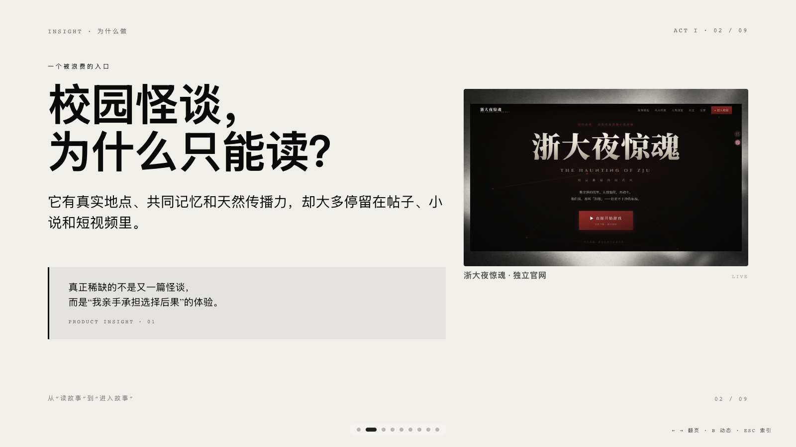
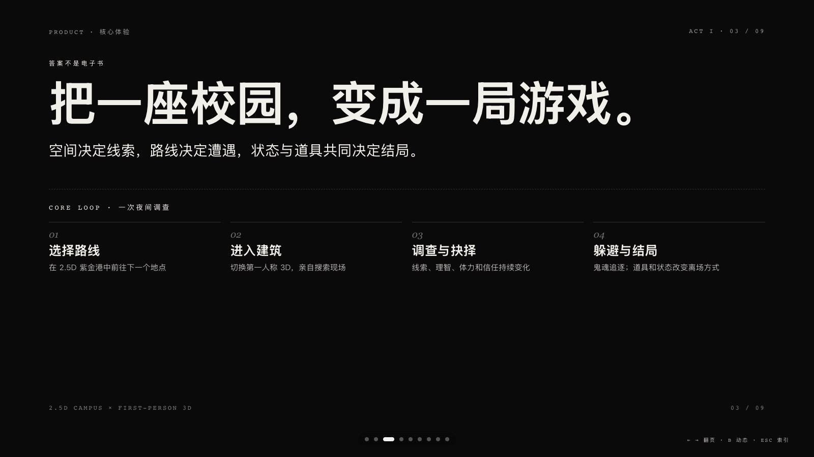
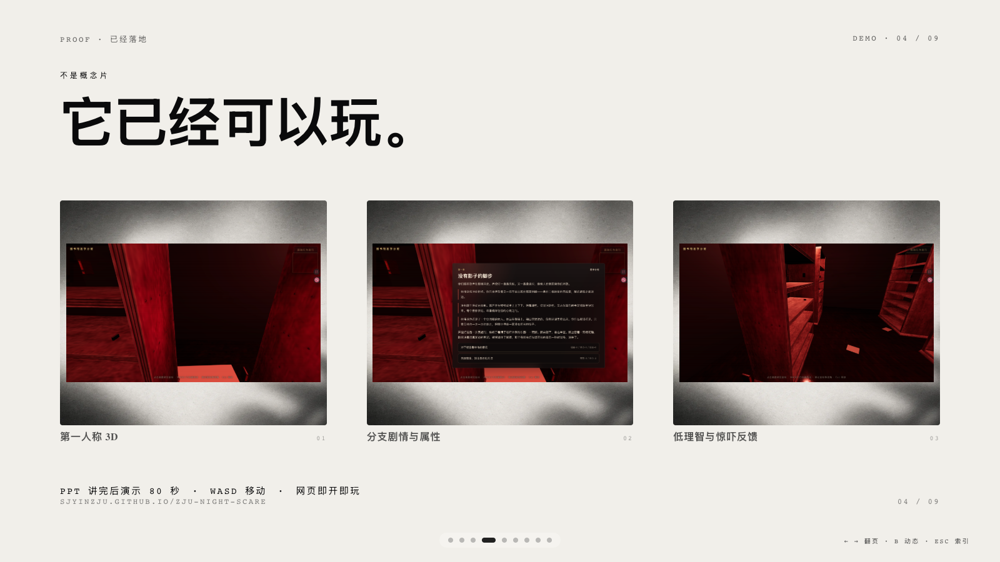
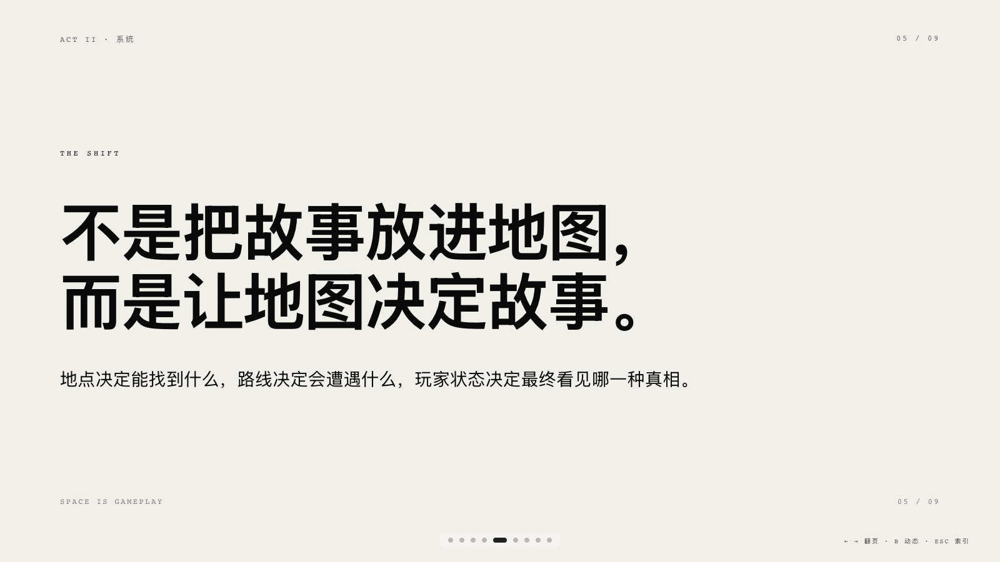
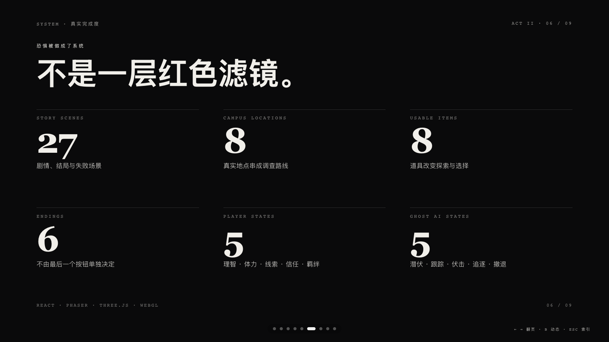
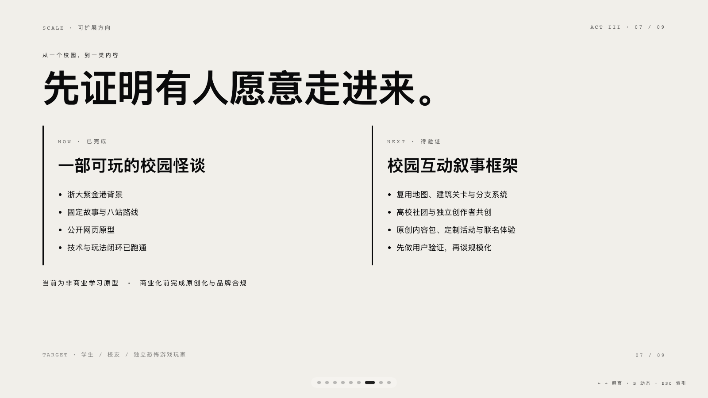
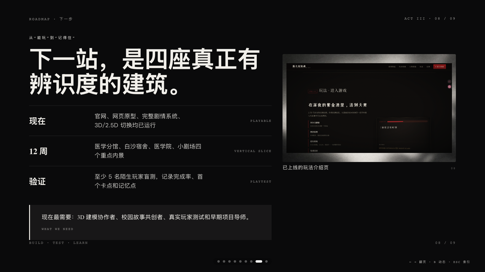
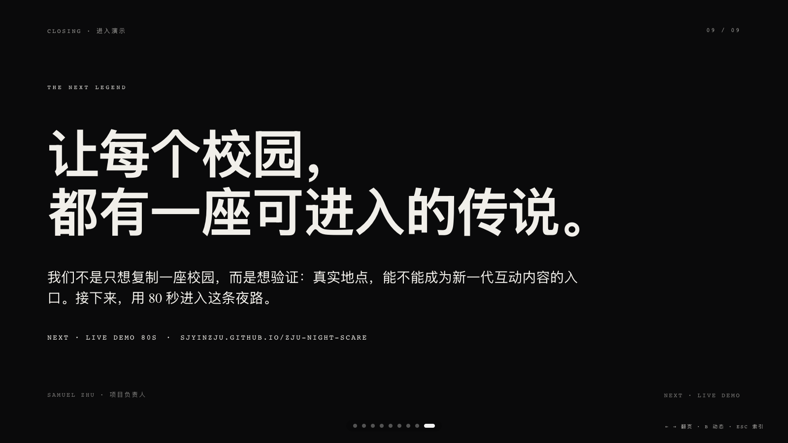

# 《浙大夜惊魂》路演材料（PPT＋讲稿）

> 路演时间：2026 年 8 月 6 日下午
> 形式：8 分钟 PPT 路演＋4 分钟问答
> 项目负责人：Samuel Zhu
> 试玩地址：https://sjyinzju.github.io/ZJU-night-scare/
> GitHub：https://github.com/sjyinzju/ZJU-night-scare

## 表单提交版（直接粘贴）

**项目名称：** 浙大夜惊魂

**100 字简介：**《浙大夜惊魂》是一款以浙大紫金港校区为原型的网页互动游戏。玩家穿梭于2.5D校园地图与第一人称3D建筑，调查失踪事件，搜集线索、管理理智、躲避鬼魂并做出关键抉择，改变人物关系，走向六种结局。即开即玩。

## 项目简介

《浙大夜惊魂》是一款以浙江大学紫金港校区为原型的网页互动叙事游戏。玩家在 2.5D 校园地图与第一人称 3D 建筑之间探索，通过收集线索、管理理智、躲避鬼魂和关键抉择，调查一连串坠楼与失踪事件，并走向六种结局。网页即开即玩，无需下载。

## PPT 文件

- HTML 路演稿：[`index.html`](index.html)
- 路演大纲：[`outline.md`](outline.md)
- 完整讲稿与问答：[`speaker-notes.md`](speaker-notes.md)

操作：左右方向键、滚轮或触屏翻页；`ESC` 打开索引；`B` 切换静态/动态模式。

---

## 01｜浙大夜惊魂（0:00–0:25）

大家好，我的项目叫《浙大夜惊魂》。我想先问大家一个问题：如果凌晨的紫金港不只是一个背景，而是会记住你走过哪条路、相信了谁、害怕到什么程度，你还能不能走到天亮？

我做的是一款网页即玩的校园恐怖游戏：把大家熟悉的校园怪谈，从“读一个故事”，变成“亲自走进故事”。

## 02｜校园怪谈，为什么只能读？（0:25–1:05）

校园怪谈有真实地点，有学生和校友共同的生活记忆，也天然适合在校园里传播。但今天大多数校园怪谈还停留在帖子、小说和短视频里。读者知道故事发生在自己每天路过的地方，却始终站在故事外面。

所以我看到的机会不是再写一篇怪谈，而是把“地点认同”变成“参与感”：玩家要亲自走进去、做选择，并承担选择产生的后果。

## 03｜把一座校园，变成一局游戏（1:05–1:50）

玩家先在 2.5D 的紫金港地图里选择路线；走到关键建筑后，视角切成第一人称 3D，玩家要自己搜索现场；调查过程中会得到线索和道具，理智、体力、线索、信任、羁绊五项状态也会变化；最后，玩家要躲避鬼魂追逐，而前面走过的路线、拿到的道具和做过的选择，会共同决定结局。

也就是说，地图不是菜单，属性也不是装饰，它们都会真实参与叙事。

## 04｜它已经可以玩（1:50–2:20）

这不是一段概念片。目前网页版本已经可以直接游玩：有第一人称 3D 医学分馆、有剧情选择和属性变化，也有低理智时的失焦、色差、心跳和突然惊吓。

这里先用三张真实截图证明完成度，不在中途切出演示。PPT 全部讲完后，再用 80 秒连续演示产品。

## 05｜地图不是背景（2:20–2:45）

这个项目最核心的判断是：不是把故事放进地图，而是让地图决定故事。玩家在哪个地点，会决定能找到什么；选择哪条路线，会决定遭遇什么；当前的理智、道具和信任，则会决定最后看见哪一种真相。

## 06｜恐惧被做成了系统（2:45–3:35）

目前仓库里已经实现了 27 个剧情、结局与失败场景，覆盖 8 个校园地点、8 件可使用道具和 6 种正式结局。玩家有理智、体力、线索、信任、羁绊五项持续变化的状态；鬼魂有潜伏、跟踪、伏击、追逐、撤退五种状态，并会沿路网主动寻找玩家。

技术上，校园地图使用 Phaser，第一人称内景使用 Three.js，外层界面使用 React，全部运行在浏览器里。心跳、脚步、呼吸和部分惊吓音效会根据距离与理智实时变化。

## 07｜从一个校园，到一类内容（3:35–4:25）

现在它还是一部以浙大为背景的可玩校园怪谈。下一步要验证的是，它能不能从“一个作品”变成一套校园互动叙事框架。

地图、建筑关卡、分支剧情、理智和道具系统都可以复用，再和不同高校的社团、校史文化团队或独立创作者共同生产内容。候选方式包括原创内容包、校园定制活动和联名体验，但这些都还是待验证方向，不包装成已有收入。

当前版本是非商业学习原型；如果进入商业化，会先完成故事原创化，以及名称、校徽、建筑素材和品牌授权的合规处理。

## 08｜下一步：四座有辨识度的建筑（4:25–5:35）

我们已经完成了官网、可玩的网页版本、完整剧情系统，以及第一人称 3D 和 2.5D 校园之间的切换。接下来 12 周，把医学分馆、白沙宿舍、医学院和小剧场四个地点做深，分别承担声音定位、走廊异常观察、门禁与逃生、舞台机关与终局推理。

完成后至少找 5 名陌生玩家盲玩，记录主线完成率、第一次卡住的位置和最有记忆点的场景。现在最需要的帮助是 3D 建模协作者、校园故事共创者、真实玩家测试，以及早期项目导师对产品方向和验证方式的反馈。

## 09｜让每个校园，都有一座可进入的传说（5:35–6:20）

《浙大夜惊魂》不是只想复制一座校园。我们真正想验证的是：真实地点和共同记忆，能不能成为新一代互动内容的入口。

希望未来每个校园，都有一座能被玩家亲自走进去的传说。接下来我不再讲 PPT，直接用 80 秒，让大家进入这条夜路。

## 产品演示（6:20–8:00，含切换与收口）

1. 切到提前打开的试玩页，点击“直接开始游戏”。
2. 展示 2.5D 校园、主线目标和路线引导。
3. 进入医学分馆第一人称 3D，用 WASD 和鼠标展示空间探索。
4. 打开一段剧情选择，指出理智、线索或信任发生变化。
5. 停在最有氛围的产品画面上收口，不再切回 PPT。

---

## 审核时希望重点帮忙看

1. “校园互动叙事框架”的扩展方向是否讲得太早或太抽象。
2. 6 分 20 秒 PPT＋1 分 20 秒结尾演示的节奏是否清楚。
3. 商业路径的表达是否足够克制，又能让投资人看到想象空间。
4. 对知识产权与校园品牌合规的说明是否需要提前到正文。
5. 第 8 页的合作诉求是否应该进一步聚焦。

## 4 分钟问答准备

完整答案见 [`speaker-notes.md`](speaker-notes.md) 末尾，覆盖目标用户、商业模式、项目壁垒、网页形态、知识产权风险和当前完成度。
